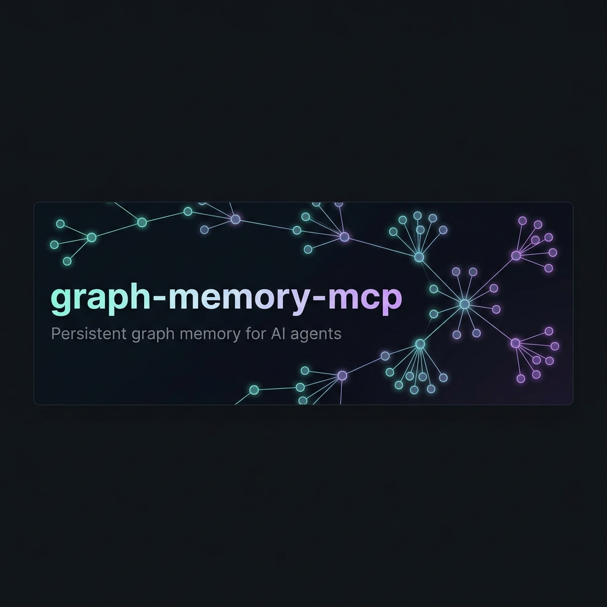

<p align="center">
  
</p>

<p align="center">
  <strong>Persistent, structured memory for AI agents — backed by a real knowledge graph.</strong><br/>
  Your LLM remembers facts, decisions, and context <em>across every conversation</em>.
</p>

<p align="center">
  <a href="https://pypi.org/project/graph-memory-mcp"></a>
  
  
  
</p>

---

## Why graph-memory-mcp?

Most LLMs forget everything when the conversation ends.  
`graph-memory-mcp` fixes that by giving your AI a **persistent knowledge graph** it can read and write through any MCP-compatible client.

| Without graph-memory-mcp | With graph-memory-mcp |
|--------------------------|----------------------|
| "What did we decide about the DB schema?" → ❌ no idea | ✅ Recalls the decision node, when it was made, and what it contradicts |
| Context stuffed into a 200k-token prompt | Compact subgraph — only relevant nodes retrieved |
| Flat bullet-list memory | Typed edges: `relates_to`, `contradicts`, `depends_on`, `updates`… |
| One session, one agent | Multi-tenant, multi-session, multi-agent |

---

## Demo

<p align="center">
  
</p>

---

## Quick start — 30 seconds

```bash
pip install graph-memory-mcp
graph-memory-mcp init
```

The `init` wizard detects your MCP client, writes its config file, and creates
the database directory — no JSON editing required. Supports **Claude Desktop**,
**Cursor**, **Codex**, and a generic JSON fallback.

After init, restart your MCP client. Your AI will now have access to all 15
memory tools automatically.

---

## How it works

```
Your AI agent
     │  MCP (stdio or HTTP)
     ▼
graph-memory-mcp
     │
     ├─ store_node("Prefer TypeScript over Python", type=preference)
     ├─ store_edge(preference → project, relates_to)
     ├─ query_graph("what does the user prefer?")
     └─ observe_conversation(user_msg, assistant_msg)  ← auto-extracts facts
     │
     ▼
Knowledge graph (SQLite locally · Neo4j in production)
```

Every piece of memory is a **typed node** with semantic embeddings.  
Queries understand natural language including temporal phrases like *"recently"*, *"last week"*, *"originally"*.

---

## Memory model

**Node types** — what gets stored:

| Type | Example |
|------|---------|
| `fact` | "The API uses JWT tokens" |
| `preference` | "User prefers dark mode" |
| `decision` | "Chose PostgreSQL over MySQL" |
| `entity` | "Project: graph-memory-mcp" |
| `concept` | "Rate limiting" |
| `question` | "Should we add GraphQL?" |
| `note` | "TODO: add integration tests" |

**Edge types** — how nodes connect:

`relates_to` · `contradicts` · `depends_on` · `part_of` · `updates` · `derived_from` · `similar_to`

---

## MCP tools

> Your AI calls these directly — you don't need to use them manually.

| Tool | What it does |
|------|-------------|
| `store_node` | Save a fact, preference, decision, or note |
| `store_edge` | Link two nodes with a typed relationship |
| `query_graph` | Semantic + temporal search across the graph |
| `get_related` | Traverse edges from a specific node |
| `update_node` | Update content or tags on an existing node |
| `delete_node` | Remove a node and all its edges |
| `decompose_and_store` | Break long content into atomic nodes automatically |
| `observe_conversation` | Auto-extract and store facts from a conversation turn |
| `graph_diff` | See what changed in the last N hours |
| `prime_context` | Generate a compact brief for a new conversation |
| `get_topics` | Detect topic clusters via community detection |
| `get_stats` | Node/edge counts and most-connected nodes |
| `export_graph_html` | Interactive browser visualization |
| `export_graph_backup` | Portable JSON backup |
| `import_graph_backup` | Restore from a JSON backup |

---

## Installation

### Local / development (SQLite, no extra services)

```bash
python3 -m venv .venv && source .venv/bin/activate
pip install -e ".[dev]"
graph-memory-mcp init        # ← writes your client config automatically
```

### Production (Neo4j backend)

```bash
pip install -e ".[dev,neo4j]"
```

Then run the server:

```bash
GRAPH_MEMORY_TRANSPORT=http \
GRAPH_MEMORY_BACKEND=neo4j \
GRAPH_MEMORY_DEFAULT_TENANT_ID=workspace-default \
GRAPH_MEMORY_NEO4J_URI=bolt://localhost:7687 \
GRAPH_MEMORY_NEO4J_USERNAME=neo4j \
GRAPH_MEMORY_NEO4J_PASSWORD=change-me \
graph-memory-mcp
```

### Docker

```bash
docker build -t graph-memory-mcp:latest .

docker run --rm -p 8080:8080 \
  -e GRAPH_MEMORY_TRANSPORT=http \
  -e GRAPH_MEMORY_BACKEND=neo4j \
  -e GRAPH_MEMORY_DEFAULT_TENANT_ID=workspace-default \
  -e GRAPH_MEMORY_NEO4J_URI=bolt://host.docker.internal:7687 \
  -e GRAPH_MEMORY_NEO4J_USERNAME=neo4j \
  -e GRAPH_MEMORY_NEO4J_PASSWORD=change-me \
  graph-memory-mcp:latest
```

---

## Manual client configuration

If you prefer to edit config files directly, or the `init` wizard doesn't cover
your client, here are the snippets.

### Claude Desktop — `claude_desktop_config.json`

```json
{
  "mcpServers": {
    "graph-memory": {
      "command": "/path/to/.venv/bin/python",
      "args": ["-m", "graph_memory.server"],
      "env": {
        "PYTHONPATH": "/path/to/graph-memory-mcp/src",
        "GRAPH_MEMORY_TRANSPORT": "stdio",
        "GRAPH_MEMORY_BACKEND": "sqlite",
        "GRAPH_MEMORY_DB_PATH": "~/.graph-memory/memory.db",
        "GRAPH_MEMORY_DEFAULT_TENANT_ID": "local-default",
        "GRAPH_MEMORY_MODEL": "all-MiniLM-L6-v2"
      }
    }
  }
}
```

### Codex — `codex_config.toml`

```toml
[mcp_servers.graph-memory]
command = "/path/to/.venv/bin/python"
args    = ["-m", "graph_memory.server"]
cwd     = "/path/to/graph-memory-mcp"
env     = {
  PYTHONPATH                    = "/path/to/graph-memory-mcp/src",
  GRAPH_MEMORY_TRANSPORT        = "stdio",
  GRAPH_MEMORY_BACKEND          = "sqlite",
  GRAPH_MEMORY_DB_PATH          = "~/.graph-memory/memory.db",
  GRAPH_MEMORY_DEFAULT_TENANT_ID = "local-default",
  GRAPH_MEMORY_MODEL            = "all-MiniLM-L6-v2"
}
```

A pre-filled example is in [`codex_config.example.toml`](./codex_config.example.toml).

---

## Environment variables

<details>
<summary>Click to expand all environment variables</summary>

### Core

| Variable | Default | Description |
|----------|---------|-------------|
| `GRAPH_MEMORY_BACKEND` | `sqlite` | `sqlite` or `neo4j` |
| `GRAPH_MEMORY_TRANSPORT` | `stdio` | `stdio` or `http` |
| `GRAPH_MEMORY_MODEL` | `all-MiniLM-L6-v2` | sentence-transformers model |
| `GRAPH_MEMORY_DEFAULT_TENANT_ID` | `local-default` | default tenant |
| `GRAPH_MEMORY_EXPORT_DIR` | — | optional export directory |

### SQLite

| Variable | Default | Description |
|----------|---------|-------------|
| `GRAPH_MEMORY_DB_PATH` | `memory.db` | path to the SQLite file |

### HTTP service

| Variable | Default | Description |
|----------|---------|-------------|
| `GRAPH_MEMORY_HTTP_HOST` | `0.0.0.0` | bind host |
| `GRAPH_MEMORY_HTTP_PORT` | `8080` | bind port |
| `GRAPH_MEMORY_LOG_LEVEL` | `INFO` | log level |
| `GRAPH_MEMORY_RATE_LIMIT_RPM` | `120` | global rate limit (req/min) |
| `GRAPH_MEMORY_WRITE_RATE_LIMIT_RPM` | `60` | write-tool rate limit |
| `GRAPH_MEMORY_MAX_CONCURRENT_REQUESTS` | `8` | concurrency cap |
| `GRAPH_MEMORY_MAX_PAYLOAD_BYTES` | `1048576` | max request size |
| `GRAPH_MEMORY_REQUEST_TIMEOUT_SECONDS` | `30` | per-request timeout |

### Neo4j

| Variable | Description |
|----------|-------------|
| `GRAPH_MEMORY_NEO4J_URI` | Bolt URI, e.g. `bolt://localhost:7687` |
| `GRAPH_MEMORY_NEO4J_USERNAME` | Neo4j username |
| `GRAPH_MEMORY_NEO4J_PASSWORD` | Neo4j password |
| `GRAPH_MEMORY_NEO4J_DATABASE` | Neo4j database name |

</details>

---

## Admin commands

```bash
# Create a tenant
graph-memory-mcp create-tenant --tenant-id workspace-a --name "Workspace A"

# Issue an API key (raw key returned once — store it securely)
graph-memory-mcp create-api-key --tenant-id workspace-a --name "ci-agent"

# List keys for a tenant
graph-memory-mcp list-api-keys --tenant-id workspace-a

# Revoke a key
graph-memory-mcp revoke-api-key --api-key-id <id>

# Migrate SQLite data → Neo4j
GRAPH_MEMORY_BACKEND=neo4j GRAPH_MEMORY_NEO4J_URI=bolt://localhost:7687 \
GRAPH_MEMORY_NEO4J_USERNAME=neo4j GRAPH_MEMORY_NEO4J_PASSWORD=change-me \
  graph-memory-mcp migrate-sqlite --db-path ./memory.db --tenant-id workspace-a
```

---

## Kubernetes & observability

Full production deployment assets are in [`deploy/`](./deploy/):

| Path | What's inside |
|------|--------------|
| `deploy/kubernetes/` | Deployment, Service, Ingress (TLS), NetworkPolicy, HPA, PDB, cert-manager, ExternalSecrets — see [`deploy/kubernetes/README.md`](./deploy/kubernetes/README.md) |
| `deploy/observability/` | Prometheus scrape config, Grafana dashboard, one-command Docker Compose observability stack |

---

## Runbooks

Operational runbooks are in [`docs/runbooks/`](./docs/runbooks/):

- [API key rotation](./docs/runbooks/api-key-rotation.md) — zero-downtime create-then-revoke
- [Incident response](./docs/runbooks/incident-response.md) — Neo4j down, OOM, rate storm, auth failures
- [Backup & restore](./docs/runbooks/backup-restore.md) — manual and automated drill
- [Tenant onboarding](./docs/runbooks/onboarding.md) — new tenant checklist
- [Secret management](./docs/runbooks/secret-management.md) — External Secrets + cert-manager

---

## Testing

```bash
.venv/bin/pytest -q
```

Coverage: graph CRUD, deduplication, conflict detection, tenant isolation,
backup/import, stdio MCP, HTTP auth/health/metrics, payload limits.

```bash
# End-to-end backup/restore drill
GRAPH_MEMORY_HOST=http://localhost:8080 GRAPH_MEMORY_API_KEY=<key> \
  ./scripts/backup_restore_drill.sh

# Load test (p50/p95/p99 latency report)
GRAPH_MEMORY_API_KEY=<key> ./scripts/load_test.sh --medium
```

---

## Architecture

```
graph-memory-mcp
├── Core domain    graph CRUD · dedup · embeddings · conflict detection · export/import
├── Transport      stdio MCP (Codex/Desktop) · streamable HTTP MCP (Kubernetes)
└── Platform       config · auth · tenant isolation · rate limiting · logging · metrics
```

**Backend:**
- Local/dev → SQLite (zero config, instant start)
- Production → Neo4j (`GRAPH_MEMORY_TRANSPORT=http` requires `GRAPH_MEMORY_BACKEND=neo4j`)

---

## Project layout

```
graph-memory-mcp/
├── assets/                   ← banner + demo SVG
├── deploy/
│   ├── kubernetes/           ← full K8s manifests + guide
│   └── observability/        ← Prometheus + Grafana stack
├── docs/runbooks/            ← operational runbooks
├── scripts/
│   ├── load_test.py / .sh
│   └── backup_restore_drill.py / .sh
├── src/graph_memory/         ← server, graph, neo4j_graph, auth, config …
├── tests/
├── Dockerfile
├── pyproject.toml
└── README.md
```

---

## License

MIT — see [LICENSE](./LICENSE).
